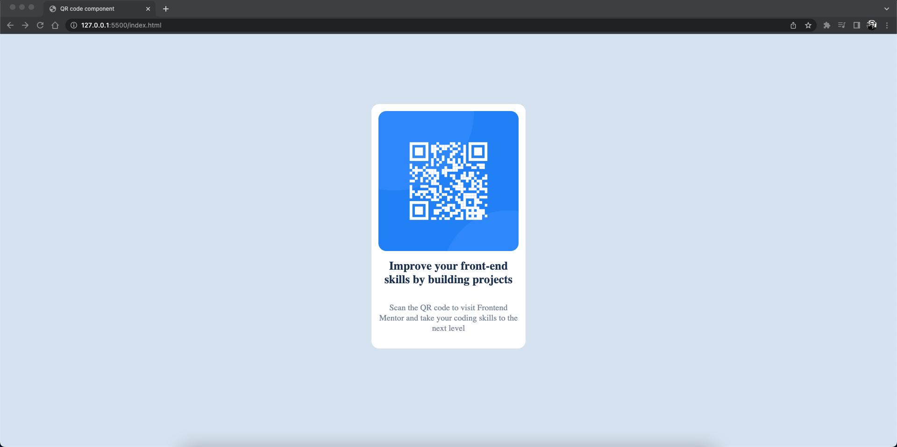

# Frontend Mentor - QR code component 

## Table of contents

- [Overview](#overview)
- [Screenshot](#screenshot)
- [Links](#links)

## Overview
- QR Code component created with HTML and CSS.

## Screenshot

## Links

- Live Site URL: [https://qr-code-component-brijen.vercel.app](https://qr-code-component-brijen.vercel.app)

## Built with

- HTML
- CSS

